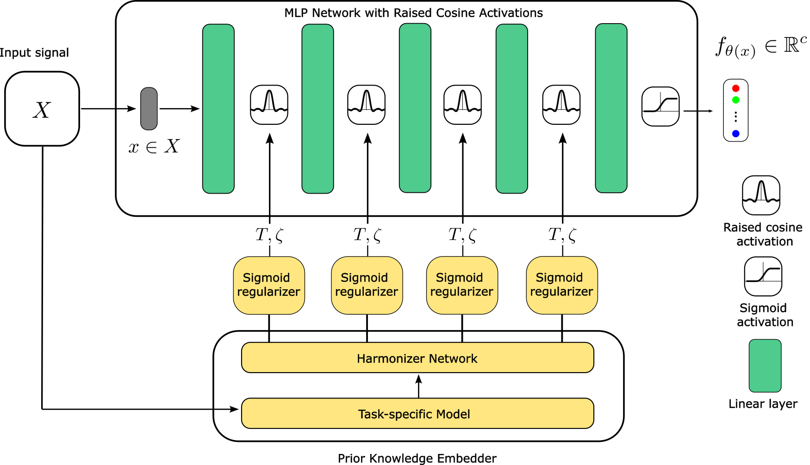
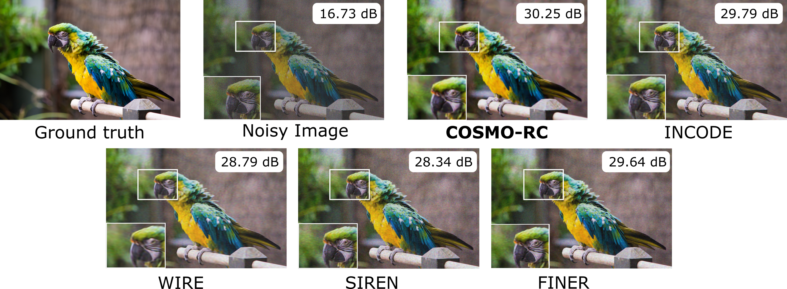
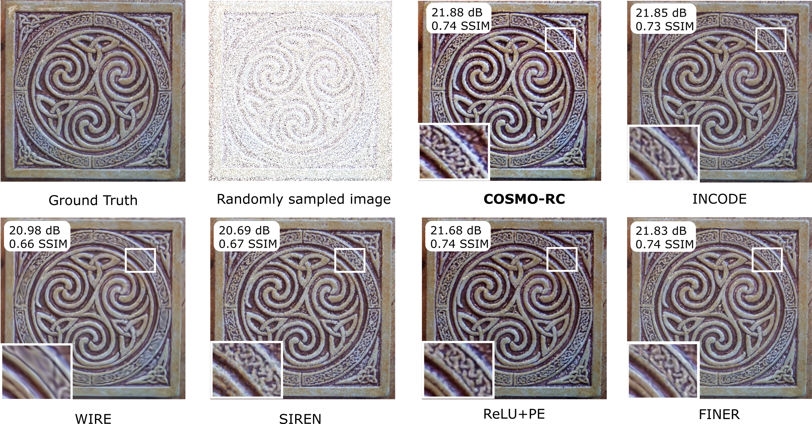
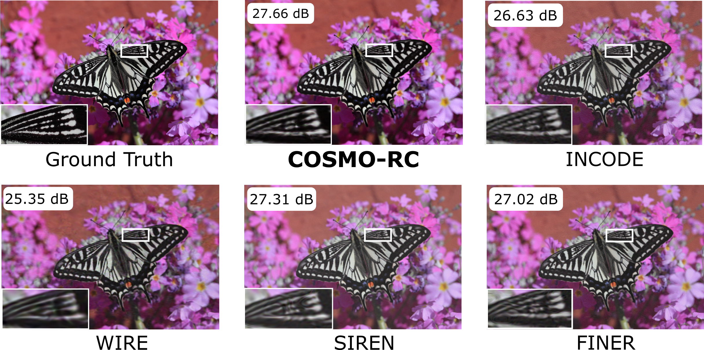

# COSMO-INR: Complex Sinusoidal Modulation for Implicit Neural Representations.
[]([https://arxiv.org/](https://arxiv.org/html/2505.11640v3))
[](https://www.python.org/downloads/)
[](https://pytorch.org/)
[](https://opensource.org/licenses/MIT)

> **Update:** Accepted at *ICLR 2026*.

## Overview
Implicit neural representations (INRs) offer a continuous alternative to discrete signal representations, compactly encoding complex signals across computer vision tasks. However, odd and even symmetric activation functions suffer from attenuation in their post-activation spectrum. We propose COSMO-INR to addresses this limitation. By modulating activation functions using a complex sinusoidal term, the network achieves complete spectral support and mitigates spectral bias.

## Theoretical Background
Using harmonic distortion analysis and Chebyshev polynomial approximation, we show that the raised cosine activation offers the least decay for larger polynomial coefficients, providing optimal spectral bandwidth. 

* To prevent the attenuation of symmetric components, we introduce modulating the activation function by a complex sinusoid component.
* The outputs at each layer are complex-valued and normalized to the unit circle on the complex plane to ensure a stable learning curve. To accelerate convergence, we integrate a task-specific prior knowledge embedder (e.g., ResNet-34 or ResNet3D-18) combined with a sigmoid regularizer to dynamically adjust the $T$ and $\zeta$ parameters.


*Figure 1: Complete pipeline of the COSMO-RC model architecture featuring the prior embedding sigmoid regularizer.*

## Tasks Tested
COSMO-RC establishes state-of-the-art performance across diverse signal representation and inverse problems.
* **Image Representation** (Kodak and DIV2K datasets)
* **Image Denoising** (DIV2K with Poisson photon noise)
* **Image Super-Resolution** (2x, 4x, and 6x upsampling on DIV2K)
* **Image Inpainting** (Celtic spiral knots image, 20% pixel sampling)
* **3D Occupancy Volume** (Lucy dataset, $512^3$ voxel grid)
* **Neural Radiance Fields (NeRF)** (Lego dataset novel-view synthesis)

## Key Results
COSMO-RC consistently outperforms state-of-the-art activations (SIREN, WIRE, INCODE, FINER) in accuracy, stability, and high-frequency structural preservation.

| Task | Metric | COSMO-RC | Nearest SOTA | Improvement |
| :--- | :--- | :---: | :---: | :---: |
| Image Representation (Kodak) | PSNR | **41.24 dB** | 35.57 dB (INCODE)  | +5.67 dB |
| Image Denoising | PSNR | **30.25 dB** |29.79 dB (INCODE) | +0.46 dB |
| Super-Resolution (6x) | PSNR | **27.66 dB** | 27.02 dB (FINER)  | +0.64 dB |
| NeRF (Lego) | PSNR | **29.50 dB** | 26.05 dB (INCODE) |+3.45 dB |

### 1. Image Reconstruction

*Figure 2: Qualitative comparisons for Image Reconstruction*

### 2. Image Denoising

*Figure 3: Qualitative comparisons for Image Denoising*

### 3. Image Inpainting

*Figure 3: Qualitative comparisons for Image Inpainting*

### 4. Image Super Resolution

*Figure 4: Qualitative comparisons for Image Super resolution*


## Getting Started

### 1. Environment Setup
Create a virtual environment and install the required dependencies.

```bash
git clone [https://github.com/USERNAME/COSMO-INR.git](https://github.com/USERNAME/COSMO-INR.git)
cd COSMO-INR
python -m venv venv
source venv/bin/activate  # On Windows: venv\Scripts\activate
pip install -r requirements.txt
